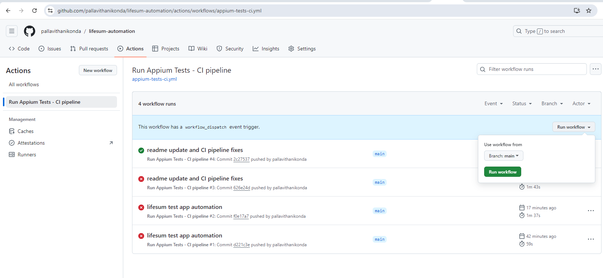

# Lifesum App Automation

This project automates testing for the Lifesum app using Appium and WebdriverIO. It performs tests to verify the app's functionality of fetching food items by tapping a red circle or shaking the device.

**Device/OS:** Considering only Android in this setup.

## Setup and Installation

### Prerequisites
- Node.js and npm installed.
- Appium installed globally (`npm install -g appium`).
- Android SDK installed with emulator access or a connected Android device.

- [Node.js](https://nodejs.org/)
- [Appium Server](http://appium.io/)

### Installation Steps

1. Clone the repository:

```bash
   git clone https://github.com/pallavithanikonda/lifesum-automation.git
   cd lifesum-automation
   ```
2. Install dependencies:

```bash
   git clone https://github.com/pallavithanikonda/lifesum-automation.git
   cd lifesum-automation
   ```
3. Place the APK file in the project directory:

    - Ensure Lifesum-test-app-debug.apk is located in the /mnt/data/ directory.

## Folder Structure

```bash
Lifesum-Automation
├── .github/
│   └── workflows/
│       └── appium-tests-ci.yml # Run test when we have new commits
│ 
├── tests/
│   └── food_fetch_test.js   # Test file with cases for food fetching
├── wdio.conf.js             # WebdriverIO configuration
├── README.md                # Project documentation
├── package.json             # package dependencies 
├── .gitignore               # ignore files when commiting code

```

## Running the Tests

1. Start the Appium server:


```bash
   appium
   ```

2. Run the tests:

```bash
   npx wdio run wdio.conf.js
   ```

## Github Actions

### CI Tests:
We have implemented test pipeline for CI flow, on each commit the pipeline will be triggered and run the tests markes as @smoke! The below are added as smoke but can be adjested as we agreed.

- Tap test
- Shake test

**PS:** Still it is sudo pipeline with the setup, need some more work

**Pipeline :** https://github.com/pallavithanikonda/lifesum-automation/actions/workflows/appium-tests-ci.yml



## Test Cases

- **Tap Test:** Verifies that tapping the red circle fetches a food item.  
  

- **Shake Test:** Simulates a shake to fetch a new food item.

    
    
  


